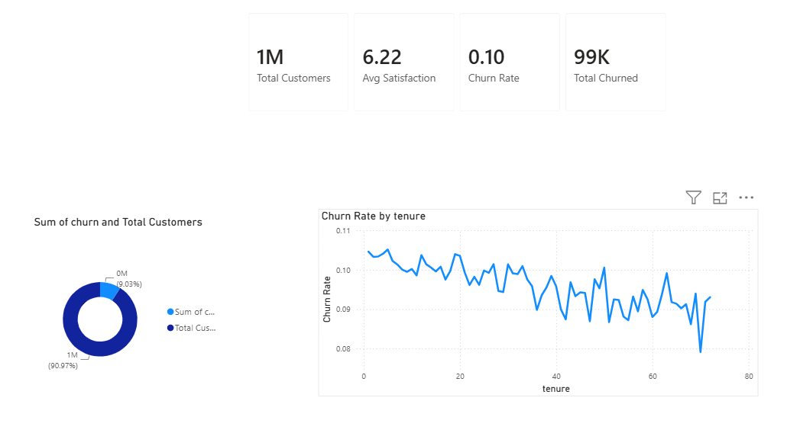
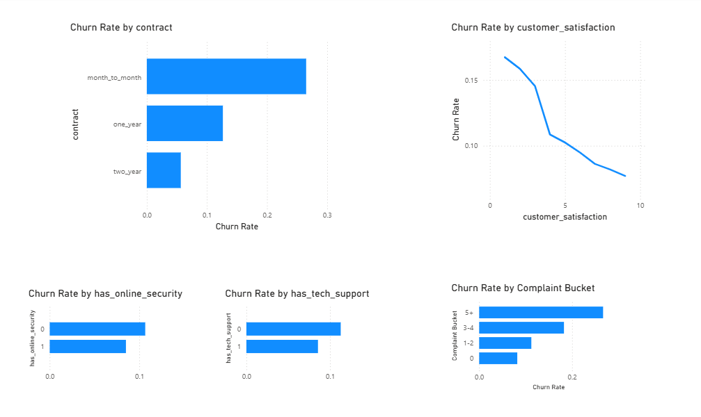

# Churn Risk Dashboard

End-to-end churn analysis on 1M telecom customers — SQL cleaning, Python EDA, and an interactive Power BI dashboard uncovering key churn drivers and a compounding-risk customer segment (up to 55% churn rate).

## Overview

This project analyzes a 1-million-row synthetic telecom customer dataset to identify what actually drives customer churn, and translates those findings into a 4-page interactive Power BI dashboard with actionable business recommendations.

**Tech stack:** SQL Server (SSMS) → Python (pandas) → Power BI

## Project Pipeline

### 1. SQL — Data Cleaning
- Checked for duplicate records — none found
- Scanned all numeric columns for negative/impossible values — none found
- Identified missing values in 4 columns (2–5% each) and confirmed missingness was random, not linked to churn
- Fixed incorrect data types (age, dependents, tenure stored as text; signup_date stored as text instead of datetime)
- Verified category columns (gender, education, contract, payment method) had no inconsistent spelling/casing

See [`sql/SQLFile_clean.sql`](sql/SQLFile_clean.sql)

### 2. Python — Missing Values, Outliers, EDA
- Imputed missing values using logic matched to each column (0 for complaint counts, median for skewed numeric fields, mode for satisfaction ratings)
- Sanity-checked outliers against real-world ranges rather than blindly removing statistical outliers — kept heavy users/high earners since they're valid customers, not data errors
- Ran churn-rate and correlation analysis across all 32 columns to separate real churn drivers from noise

See [`python/connect_sql.py`](python/connect_sql.py)

### 3. Power BI — Interactive Dashboard
A 4-page dashboard built on the cleaned dataset:

| Page | Contents |
|---|---|
| **Executive Overview** | KPI cards, churn split donut, churn rate by tenure |
| **Churn Drivers** | Contract type, satisfaction, complaints, tech support/security comparisons |
| **Customer Segmentation** | Complaints × Contract heatmap matrix, interactive Decomposition Tree |
| **Recommendations** | Custom Risk Score (DAX), High Risk Customer count, prioritized action list |

## Key Findings

- **Contract type is the strongest single churn driver** — month-to-month customers churn at 26.5% vs. 5.7% for two-year contracts (~5x difference)
- **Complaints predict churn sharply** — churn rises from 8.1% (0 complaints) to ~34% (6+ complaints)
- **Satisfaction score shows a smooth, consistent decline** — from 16.7% churn at the lowest rating to 7.5% at the highest
- **Risk factors compound** — customers with 5+ complaints on month-to-month contracts churn at 55%, vs. just 5% for satisfied long-term customers — an 11x spread
- **Demographics are not meaningful churn predictors** — age, gender, income, education, and marital status all show near-zero correlation with churn. This is a service-experience problem, not a "type of customer" problem
- **A specific high-risk micro-segment exists**: elderly customers (60+) with low satisfaction and high complaints remain high-risk even when they already have tech support — suggesting support *quality*, not just availability, needs review

## Recommendations

1. Offer contract-upgrade incentives to month-to-month customers, especially those with 3+ complaints
2. Build a complaint-triggered outreach workflow — flag customers proactively at 3+ complaints or satisfaction ≤3
3. Prioritize the 646 customers identified as both month-to-month and high-complaint — the highest-risk segment in the dataset
4. Bundle tech support/online security into more plans by default
5. Review support quality specifically for older, high-complaint customers, since availability alone isn't preventing churn in this group

## Dashboard Preview

### Executive Overview


### Churn Drivers


### Customer Segmentation


### Recommendations


## Repository Structure

```
churn-risk-dashboard/
├── sql/
│   └── SQLFile_clean.sql       # Data cleaning queries
├── python/
│   └── connect_sql.py          # Missing values, outliers, EDA
├── powerbi/
│   └── churn.pbix              # Interactive dashboard
├── data/
│   └── sample_data.csv         # Sample of cleaned dataset (full 1M-row files excluded — see .gitignore)
├── screenshots/
│   └── ...                     # Dashboard page previews
└── README.md
```

## Notes

- Full dataset (1M rows) is excluded from this repo due to file size — a representative sample is included in `data/`
- Dataset is synthetic, generated for portfolio/practice purposes
